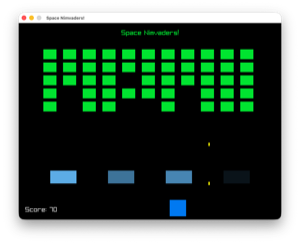

# Space Nimvaders!

This is a Space Invaders clone written in the Nim programming language with [Raylib](https://github.com/raysan5/raylib). The project's complexity is kept at a "learn enough to be dangerous" level: I intentionally avoided using existing Raylib bindings and exported only what was necessary.



The gameplay follows the standard Space Invaders mechanics: use LEFT and RIGHT arrows for movement, and SPACE to fire.

## Building and Running

To build the project, provide the path to the Raylib header and static library in `nim.cfg`. The default suggestion is `../raylib-5.5`, but you can modify it as needed. Currently, the project is macOS-only, but porting to other systems should not be difficult.

```bash
% nimble build    # Build the project
% nimble run      # Build and run the game
```
---
License: MIT

